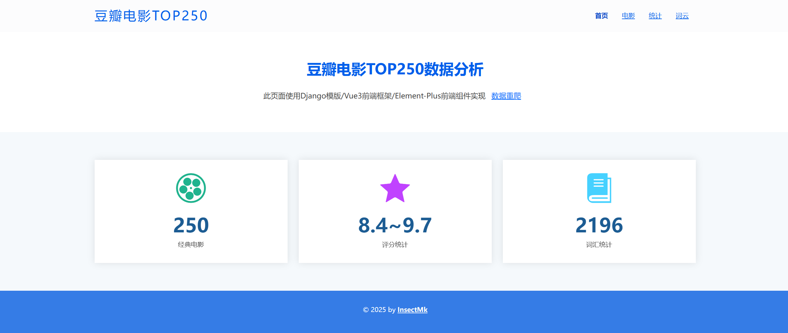
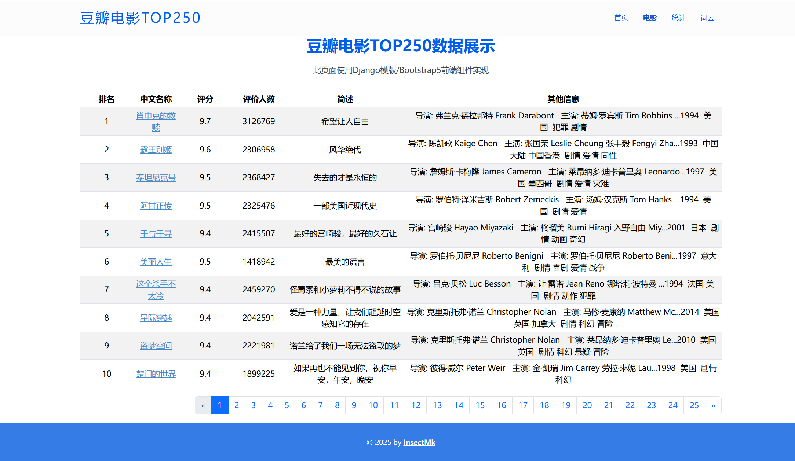
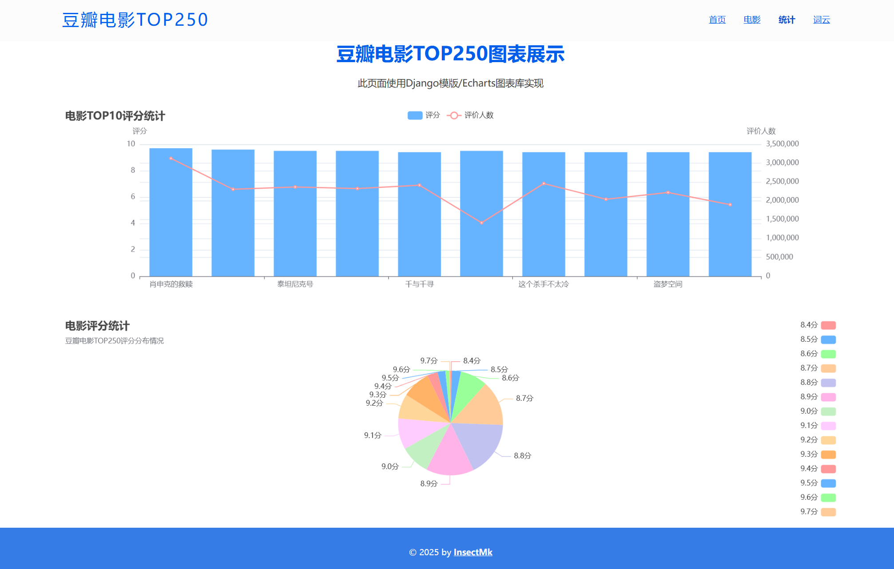
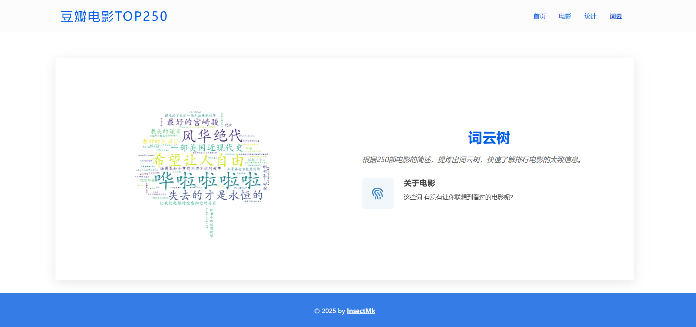
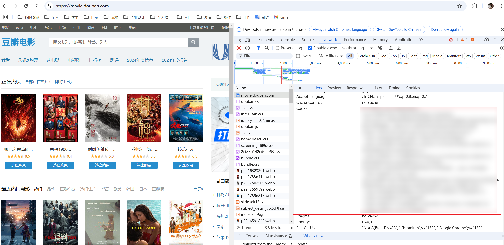

# 豆瓣爬虫

## 项目说明

### 功能

爬取数据后存储到MySQL数据库中，可再次爬取刷新

爬取豆瓣Top250电影数据并展示到网站中

数据展示包括**表格**、**图表**、**词云图**

页面及功能设计参考[Douban_Flask](https://gitee.com/xiaobai_long/Douban_Flask)

### 架构

前端使用BootStrap5、JQuery、Vue3、Element-Plus

后端采用Django、Django Template

数据库采用MySQL

**软件版本**

- Python`3.13.2`
- Django`5.1.6`
- MySQL`8.0`

## 页面展示









## 运行

1. 数据库配置

   安装[MySQL8.0](https://dev.mysql.com/downloads/mysql/8.0.html)，可以使用以下脚本创建数据库与用户

   ```sql
   -- 创建数据库 douban_crawler，字符集为 utf8mb4
   CREATE DATABASE IF NOT EXISTS douban_crawler CHARACTER SET utf8mb4 COLLATE utf8mb4_unicode_ci;
   
   -- 创建用户 douban_crawler，密码为 douban_crawler
   CREATE USER 'douban_crawler'@'%' IDENTIFIED BY 'douban_crawler';
   
   -- 授予 douban_crawler 用户对 douban_crawler 数据库的所有权限
   GRANT ALL PRIVILEGES ON douban_crawler.* TO 'douban_crawler'@'%';
   
   -- 刷新权限
   FLUSH PRIVILEGES;
   ```

   修改`douban_crawler/douban_crawler/settings.py`，填入数据库信息

   ```python
   """
   时区设置
   """
   LANGUAGE_CODE = 'zh-hans'
   
   TIME_ZONE = 'Asia/Shanghai'
   
   USE_I18N = True
   
   USE_TZ = True
   
   # 数据库
   DATABASES = {
       # 默认使用MySQL
       'default': {
           'ENGINE': 'django.db.backends.mysql',
           'NAME': 'douban_crawler',
           'USER': 'douban_crawler',
           'PASSWORD': 'douban_crawler',
           'HOST': 'localhost',
           'PORT': '3306',
       }
   }
   ```

   

2. 安装依赖：运行以下命令

   ```bash
   pip install -r requirements.txt
   ```

3. 初始化数据库：进入到`douban_crawle`目录，执行以下命令

   ```bash
   python manage.py migrate
   ```

4. 启用项目：进入到`douban_crawle`目录，执行以下命令

   ```bash
   python manage.py runserver
   ```

   

## 其他

### 403问题

豆瓣网站会检测爬虫，如果被检测了会报错403，需要在请求头配置上cookie信息，编辑`douban_crawler/main/config.py`：

```
# 爬虫请求头
CRAWLER_HEADERS = {
    "User-Agent": "Mozilla/5.0 (Windows NT 10.0; Win64; x64) AppleWebKit/537.36 (KHTML, like Gecko) Chrome/132.0.0.0 Safari/537.36",
    "Cookie": '''你的cookie信息'''
}
```

**cookie信息获取**：登录[豆瓣](https://movie.douban.com/)后，在浏览器控制台查看：



### pip

```bash
# 生成requirements.txt
pip freeze >requirements.txt
# 下载依赖
pip install -r requirements.txt
```

## 参考文档

[Douban_Flask：豆瓣电影TOP250数据分析](https://gitee.com/xiaobai_long/Douban_Flask)

[Python数据爬取超详细讲解（零基础入门，老年人都看的懂）](https://blog.csdn.net/bookssea/article/details/107309591)

[python轻松入门——爬取豆瓣Top250时出现403报错（418报错，爬虫）](https://blog.csdn.net/weixin_42710807/article/details/121187996)

[如何管理静态文件（如图片、JavaScript、CSS）](https://docs.djangoproject.com/zh-hans/5.1/howto/static-files/)

[djiango官方文档](https://docs.djangoproject.com/zh-hans/5.1/)

[手把手教你使用Django如何连接Mysql](https://developer.aliyun.com/article/1458957)

[BooStrap5官方文档](https://getbootstrap.com/docs/5.3/getting-started/introduction/)

[Echarts图表](https://echarts.apache.org/zh/index.html)

[Django 内置模板标签和过滤器](https://docs.djangoproject.com/zh-hans/5.1/ref/templates/builtins/)

[Vue3官方文档](https://cn.vuejs.org/guide/introduction.html)

[Element-Plus官方文档](https://element-plus.org/zh-CN/guide/design.html)